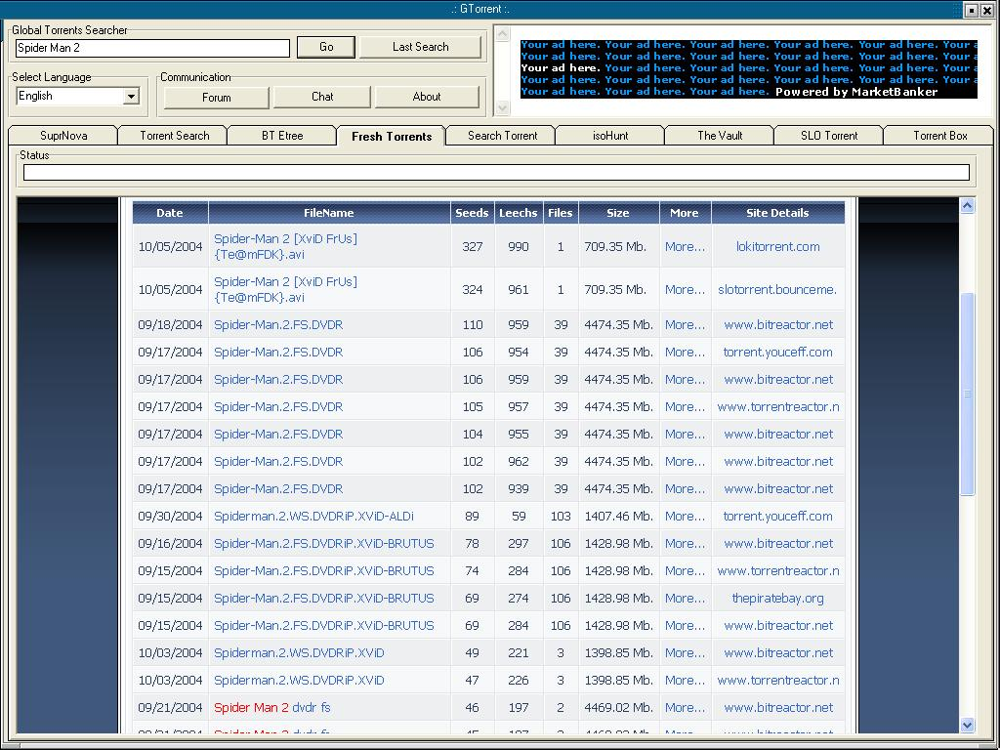



## Global Torrent Searcher

### Description

GTorrent is a Basic Way to Make a Mass Search in all Torrent Websites, you can add more BitTorrent websites :)

GTorreent Support Multi LAnguage, Popup Blocker and a KDE Interface ...
 
### More Info
 

             |
---                |---
**Submitted On**   |2004-10-04 03:54:54
**By**             |[Ashraf Magdi](https://github.com/Planet-Source-Code/PSCIndex/blob/master/ByAuthor/ashraf-magdi.md)
**Level**          |Beginner
**User Rating**    |4.6 (69 globes from 15 users)
**Compatibility**  |VB 4\.0 \(32\-bit\), VB 5\.0, VB 6\.0
**Category**       |[Internet/ HTML](https://github.com/Planet-Source-Code/PSCIndex/blob/master/ByCategory/internet-html__1-34.md)
**World**          |[Visual Basic](https://github.com/Planet-Source-Code/PSCIndex/blob/master/ByWorld/visual-basic.md)
**Archive File**   |[Global\_Tor1801641062004\.zip](https://github.com/Planet-Source-Code/ashraf-magdi-global-torrent-searcher__1-56558/archive/master.zip)

